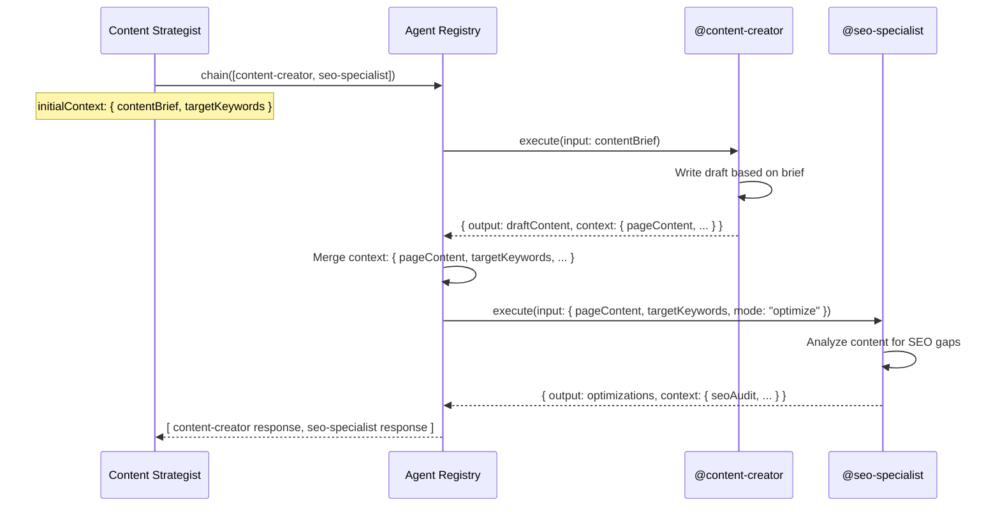

# Flow: Chain — @content-creator → @seo-specialist

**Pattern:** `@content-creator` → `@seo-specialist` (sequential chain)

**Purpose:** A writer creates draft content, then passes it to the SEO specialist for optimization before publishing. The SEO specialist reads the `pageContent` written by the content creator and returns optimizations that the writer applies.

## Sequence Diagram



## Request

```json
{
  "chain": [
    {
      "agent": "content-creator",
      "input": {
        "topic": "How to Choose the Right CRM for Small Business",
        "contentBrief": "Write a 1,500-word guide for small business owners evaluating CRM platforms. Compare pricing, features, and ease of setup. Target informational and commercial intent keywords.",
        "tone": "professional yet approachable",
        "format": "blog-post"
      }
    },
    {
      "agent": "seo-specialist",
      "input": {
        "targetKeywords": [
          {
            "keyword": "best CRM for small business",
            "searchVolume": 14300,
            "keywordDifficulty": 74,
            "intent": "commercial"
          },
          {
            "keyword": "small business CRM pricing",
            "searchVolume": 3600,
            "keywordDifficulty": 52,
            "intent": "commercial"
          },
          {
            "keyword": "how to choose CRM software",
            "searchVolume": 2800,
            "keywordDifficulty": 45,
            "intent": "informational"
          }
        ],
        "technicalMetrics": {
          "coreWebVitals": {
            "lcpMobile": 1.8,
            "lcpDesktop": 1.2,
            "inpMobile": 95,
            "inpDesktop": 45,
            "clsMobile": 0.02,
            "clsDesktop": 0.01,
            "lcpPass": true,
            "inpPass": true,
            "clsPass": true
          }
        },
        "mode": "optimize"
      }
    }
  ],
  "traceId": "chain-content-opt-002"
}
```

## Flow Walkthrough

### Step 1: @content-creator executes

The content creator agent receives the topic and brief, writes a draft, and returns it in the context under `pageContent`:

```
context.pageContent = `
# How to Choose the Right CRM for Small Business

Choosing a CRM for your small business can feel overwhelming...

## Why Your Small Business Needs a CRM

Customer relationship management software...
`
```

### Step 2: Registry merges context

The registry takes the `pageContent` from the content creator's output context and merges it. The SEO specialist's input automatically reads `pageContent` from the merged context.

### Step 3: @seo-specialist executes (optimize mode)

Because `mode: "optimize"` is used, the SEO specialist returns only high-priority, quick-win optimizations:

```json
{
  "output": {
    "summary": "Optimization scan complete: 4 high-priority actions identified. Content is well-structured but has keyword integration gaps.",
    "overallSeoScore": 72,
    "recommendations": [
      {
        "id": "rec-chain-1",
        "category": "keyword_strategy",
        "priority": "high",
        "confidence": "high",
        "title": "Primary commercial keyword underused in headings",
        "description": "'Best CRM for small business' (14,300/mo) appears only once in body text. Add an H2 section title like 'Best CRM for Small Business: Top Picks Compared'.",
        "expectedImpact": "Stronger relevance signal for highest-volume keyword.",
        "implementationEffort": "low",
        "estimatedTimeToImpact": "2–4 weeks",
        "relevantKeywords": ["best CRM for small business"]
      },
      {
        "id": "rec-chain-2",
        "category": "on_page",
        "priority": "high",
        "confidence": "high",
        "title": "Missing comparison table for commercial intent",
        "description": "Competitor pages ranking for 'best CRM for small business' all include a comparison table. Add a pricing/feature comparison table to capture featured snippet.",
        "expectedImpact": "Featured snippet eligibility and improved dwell time.",
        "implementationEffort": "medium",
        "estimatedTimeToImpact": "2–4 weeks",
        "relevantKeywords": ["best CRM for small business", "small business CRM pricing"]
      },
      {
        "id": "rec-chain-3",
        "category": "content",
        "priority": "high",
        "confidence": "medium",
        "title": "Missing FAQ section for PAA capture",
        "description": "Top-ranking pages rank in People Also Ask for 'How to choose CRM software'. Add a 4–5 question FAQ section with concise answers.",
        "expectedImpact": "PAA rich result visibility for informational keyword.",
        "implementationEffort": "low",
        "estimatedTimeToImpact": "1–3 weeks",
        "relevantKeywords": ["how to choose CRM software"]
      },
      {
        "id": "rec-chain-4",
        "category": "content",
        "priority": "high",
        "confidence": "high",
        "title": "CTA missing for transactional conversion",
        "description": "Guide lacks a clear next step or CTA. Add a 'Start Your Free Trial' or 'Compare Pricing' CTA section after the comparison table.",
        "expectedImpact": "Improved organic-to-conversion rate.",
        "implementationEffort": "low",
        "estimatedTimeToImpact": "Immediate",
        "relevantKeywords": []
      }
    ],
    "contentOptimizations": [
      {
        "id": "opt-chain-1",
        "type": "heading_structure",
        "priority": "high",
        "currentValue": "Existing H2: 'Top CRM Features to Consider'",
        "suggestedValue": "Restructure as: 'Best CRM for Small Business: Top Features Compared'",
        "rationale": "Front-loads the high-volume keyword in the heading."
      },
      {
        "id": "opt-chain-2",
        "type": "keyword_integration",
        "priority": "high",
        "currentValue": "Keyword 'small business CRM pricing' appears 0 times.",
        "suggestedValue": "Add a dedicated 'Small Business CRM Pricing Guide' H2 section with a pricing comparison table.",
        "rationale": "3,600/mo commercial keyword with moderate difficulty — easy win."
      },
      {
        "id": "opt-chain-3",
        "type": "content_gap",
        "priority": "high",
        "currentValue": "No FAQ section present.",
        "suggestedValue": "Add FAQ: 'What is the best CRM for small business?', 'How much does a small business CRM cost?', 'Which CRM is easiest to set up?', 'Do I need a CRM for my small business?'",
        "rationale": "Targets PAA results and FAQ rich snippets."
      }
    ],
    "technicalFixes": [],
    "keywordGapAnalysis": [],
    "linkOpportunities": [],
    "serpFeatureOpportunities": [
      {
        "featureType": "featured_snippet",
        "keyword": "best CRM for small business",
        "currentOwner": "forbes.com",
        "captureStrategy": "Create a 'Best CRM for Small Business at a Glance' comparison table as the first content block after the intro. Use table markup.",
        "priority": "high",
        "confidence": "medium"
      },
      {
        "featureType": "people_also_ask",
        "keyword": "how to choose CRM software",
        "currentOwner": "multiple domains",
        "captureStrategy": "Add FAQ section with question-based H3s. Mark up with FAQ schema.",
        "priority": "medium",
        "confidence": "high"
      }
    ]
  }
}
```

### Step 4: User receives both responses

The content strategist gets:
1. The full draft from `@content-creator`
2. A concise optimization brief from `@seo-specialist` with 4 specific, actionable changes

The writer applies the optimizations (add comparison table, FAQ section, fix headings) and publishes a fully SEO-optimized post.

## Key Design Points

- **Context flows automatically**: `pageContent` written by `@content-creator` is available for `@seo-specialist` to read.
- **Optimize mode is purpose-built for chains**: It returns only high/critical items so the writer doesn't get overwhelmed by a full audit.
- **Latency is additive**: Chain waits for each agent to finish. Total time = content-creator duration + seo-specialist duration.
- **Chain breaks on failure**: If content-creator fails, seo-specialist is never called.
