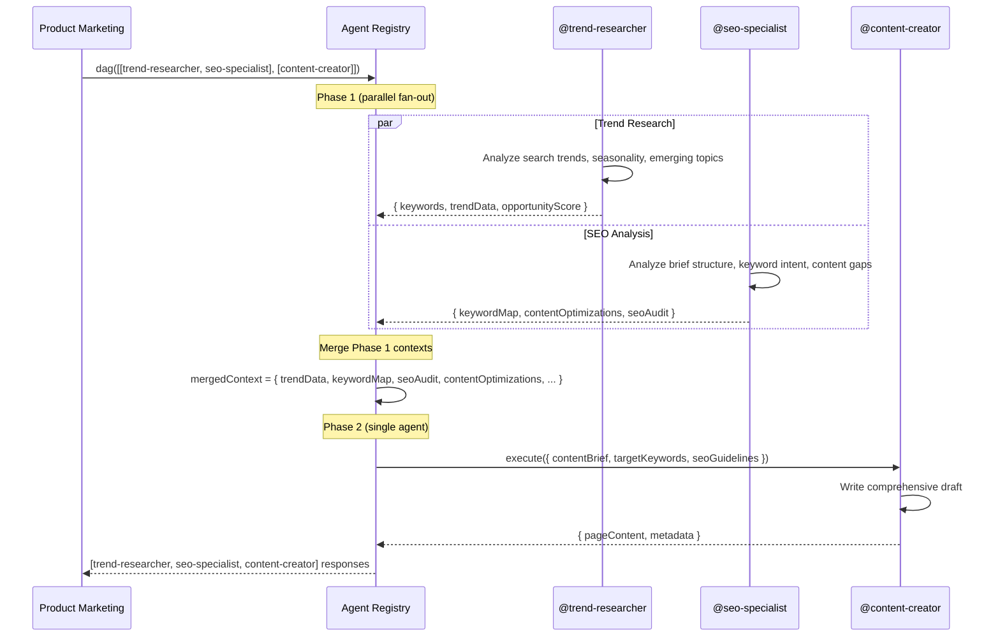

# Flow: Multi-Agent DAG — @trend-researcher → @seo-specialist → @content-creator

**Pattern:** `@trend-researcher` ⤵ `@seo-specialist` → `@content-creator` (DAG with fan-out)

**Purpose:** A full content campaign pipeline. The trend researcher discovers emerging search topics, the SEO specialist builds an optimized content brief with keyword targeting, and the content creator produces the final draft. The SEO specialist and trend researcher run in parallel (they are independent), then the content creator runs after both complete.

## Sequence Diagram



## Request

```json
{
  "phases": [
    [
      {
        "agent": "trend-researcher",
        "input": {
          "topic": "AI in small business marketing",
          "market": "US",
          "timeframe": "next-6-months",
          "sources": ["google-trends", "exploding-topics", "industry-news"],
          "depth": "comprehensive"
        },
        "traceId": "campaign-003-phase1"
      },
      {
        "agent": "seo-specialist",
        "input": {
          "pageContent": "",
          "targetKeywords": [
            {
              "keyword": "AI marketing tools small business",
              "searchVolume": 8900,
              "keywordDifficulty": 62,
              "intent": "commercial"
            },
            {
              "keyword": "AI for small business marketing",
              "searchVolume": 12400,
              "keywordDifficulty": 68,
              "intent": "informational"
            },
            {
              "keyword": "best AI marketing software 2026",
              "searchVolume": 6700,
              "keywordDifficulty": 55,
              "intent": "commercial"
            },
            {
              "keyword": "affordable AI marketing tools",
              "searchVolume": 3400,
              "keywordDifficulty": 42,
              "intent": "commercial"
            }
          ],
          "mode": "audit",
          "contentBrief": "Create a comprehensive guide on how small businesses can leverage AI for marketing. Include tool recommendations, implementation steps, and cost comparisons."
        },
        "traceId": "campaign-003-phase1"
      }
    ],
    [
      {
        "agent": "content-creator",
        "input": {
          "tone": "professional, forward-thinking, practical",
          "format": "long-form-guide",
          "wordCount": 3000,
          "structure": "guided"
        },
        "traceId": "campaign-003-phase2"
      }
    ]
  ],
  "initialContext": {
    "brand": "Nexus Marketing",
    "targetAudience": "small business owners (1–50 employees)",
    "primaryCta": "Sign up for free trial"
  },
  "traceId": "campaign-003"
}
```

## Flow Walkthrough

### Phase 1: Parallel Research & SEO Strategy

Both agents start simultaneously with the same initial context:

#### @trend-researcher findings

```json
{
  "output": {
    "trends": [
      {
        "topic": "AI content creation for small business",
        "growthRate": "+240% YoY",
        "seasonality": "peaking Q3–Q4",
        "sources": ["Google Trends", "Exploding Topics"],
        "opportunityScore": 92
      },
      {
        "topic": "AI marketing automation tools",
        "growthRate": "+180% YoY",
        "seasonality": "steady growth",
        "sources": ["Google Trends", "G2 Reviews"],
        "opportunityScore": 88
      },
      {
        "topic": "cost of AI marketing tools",
        "growthRate": "+95% YoY",
        "seasonality": "Q1 spike (budget season)",
        "sources": ["Google Trends", "Ahrefs"],
        "opportunityScore": 76
      }
    ],
    "emergingKeywords": [
      { "keyword": "AI marketing tools for beginners", "volume": 2200, "trend": "rising" },
      { "keyword": "free AI marketing tools", "volume": 18000, "trend": "stable" },
      { "keyword": "AI social media marketing small business", "volume": 4600, "trend": "rapidly rising" }
    ]
  },
  "context": {
    "trendData": { "...": "full trend output" },
    "emergingTopics": ["AI content creation", "marketing automation", "AI tool costs"]
  }
}
```

#### @seo-specialist findings

```json
{
  "output": {
    "summary": "Content brief is well-aligned with target keywords. Key opportunity: target the rapidly growing 'AI social media marketing' subtopic. Add comparison table for pricing queries.",
    "overallSeoScore": 78,
    "recommendations": [
      {
        "id": "rec-dag-1",
        "category": "keyword_strategy",
        "priority": "high",
        "confidence": "high",
        "title": "Add emerging keyword predicted by trend data",
        "description": "Trend researcher identified 'AI social media marketing small business' (+rising, 4,600/mo). Not in current keyword list. Add as secondary commercial target.",
        "expectedImpact": "Capture early growth wave of rising keyword.",
        "implementationEffort": "low",
        "estimatedTimeToImpact": "2–4 weeks",
        "relevantKeywords": ["AI social media marketing small business"]
      },
      {
        "id": "rec-dag-2",
        "category": "content",
        "priority": "high",
        "confidence": "high",
        "title": "Build comparison table for 'best AI marketing software'",
        "description": "Top competitors all feature head-to-head comparison tables. Essential for featured snippet capture on 'best AI marketing software 2026'.",
        "expectedImpact": "Featured snippet and comparison SERP feature.",
        "implementationEffort": "medium",
        "estimatedTimeToImpact": "2–4 weeks",
        "relevantKeywords": ["best AI marketing software 2026", "AI marketing tools small business"]
      },
      {
        "id": "rec-dag-3",
        "category": "keyword_strategy",
        "priority": "medium",
        "confidence": "medium",
        "title": "Add FAQ schema targeting affordability queries",
        "description": "'Affordable AI marketing tools' (3,400/mo, low difficulty 42) is a low-hanging commercial target. Add a pricing FAQ section.",
        "expectedImpact": "Quick ranking win for low-competition keyword.",
        "implementationEffort": "low",
        "estimatedTimeToImpact": "1–2 weeks",
        "relevantKeywords": ["affordable AI marketing tools"]
      }
    ],
    "keywordGapAnalysis": [
      {
        "keyword": "free AI marketing tools",
        "searchVolume": 18000,
        "keywordDifficulty": 48,
        "intent": "commercial",
        "competitorUrls": ["blog.hubspot.com/marketing/free-ai-tools", "socialbee.com/blog/free-ai-marketing-tools"],
        "opportunityScore": 85,
        "recommendation": "target_in_content"
      }
    ]
  },
  "context": {
    "keywordMap": {
      "AI marketing tools small business": { "targetUrl": "/guides/ai-marketing-small-business", "intent": "commercial", "volume": 8900, "difficulty": 62, "currentPosition": null, "owner": "pillar" },
      "AI for small business marketing": { "targetUrl": "/guides/ai-marketing-small-business", "intent": "informational", "volume": 12400, "difficulty": 68, "currentPosition": null, "owner": "satellite" },
      "best AI marketing software 2026": { "targetUrl": "/guides/ai-marketing-small-business", "intent": "commercial", "volume": 6700, "difficulty": 55, "currentPosition": null, "owner": "satellite" },
      "affordable AI marketing tools": { "targetUrl": "/guides/ai-marketing-small-business", "intent": "commercial", "volume": 3400, "difficulty": 42, "currentPosition": null, "owner": "satellite" },
      "AI social media marketing small business": { "targetUrl": "/guides/ai-marketing-small-business", "intent": "commercial", "volume": 4600, "difficulty": 50, "currentPosition": null, "owner": "satellite" }
    },
    "seoAudit": { "...": "full seo output" },
    "contentOptimizations": {
      "/guides/ai-marketing-small-business": [
        { "type": "content_gap", "priority": "high", "currentValue": "No comparison table", "suggestedValue": "Add comparison table: Tool A vs Tool B vs Tool C with pricing, features, ease-of-use columns", "rationale": "Essential for commercial intent and snippet capture" },
        { "type": "keyword_integration", "priority": "high", "currentValue": "'Free AI marketing tools' not in content plan", "suggestedValue": "Include a 'Free vs Paid AI Marketing Tools' section targeting 18K/mo keyword", "rationale": "High-volume, moderate-difficulty opportunity" }
      ]
    },
    "technicalFixes": {},
    "linkOpportunities": []
  }
}
```

### Context Merge (after Phase 1)

The registry merges all context from both agents:

```
mergedContext = {
  brand: "Nexus Marketing",
  targetAudience: "small business owners (1–50 employees)",
  primaryCta: "Sign up for free trial",

  // From @trend-researcher
  trendData: { ... },
  emergingTopics: ["AI content creation", "marketing automation", "AI tool costs"],

  // From @seo-specialist
  keywordMap: { ... },          // 5 keywords with pillar/satellite roles
  seoAudit: { ... },            // Full audit output
  contentOptimizations: { ... }, // Per-page optimization suggestions
  technicalFixes: {},
  linkOpportunities: [],

  // SEO input for content creator
  targetKeywords: [ ... ],      // Expanded to include emerging keyword
  seoGuidelines: {
    includeComparisonTable: true,
    recommendedStructure: ["Introduction", "Why AI for Small Biz Marketing", "Best AI Marketing Tools (table)", "Implementation Guide", "FAQ Section"],
    faqTargets: ["affordable AI marketing tools", "free AI marketing tools"],
    serpFeatureTargets: ["featured_snippet", "people_also_ask"]
  }
}
```

### Phase 2: Content Creation

The content creator receives the enriched context with trend data, keyword map, SEO guidelines, and produces a draft:

```json
{
  "output": {
    "title": "AI Marketing for Small Business: The Complete Guide (2026)",
    "wordCount": 3450,
    "sections": [
      "Introduction: Why Small Businesses Need AI Marketing",
      "How AI Is Transforming Small Business Marketing",
      "Best AI Marketing Tools for Small Business (Comparison Table)",
      "How to Implement AI Marketing on a Budget",
      "Free vs Paid AI Marketing Tools: What You Actually Need",
      "AI for Social Media Marketing: A Small Business Guide",
      "FAQ: AI Marketing Tools for Small Business",
      "Getting Started: Your 30-Day AI Marketing Plan"
    ],
    "keyOptimizationsApplied": [
      "Comparison table with pricing and features (rec-dag-2)",
      "FAQ section with FAQ schema markup (rec-dag-3)",
      "'Free AI marketing tools' section (keyword gap)",
      "'AI social media marketing' section (emerging trend)",
      "Front-loaded 'best AI marketing software 2026' in H2"
    ]
  }
}
```

## Benefits of the DAG Pattern

| Aspect | Benefit |
|--------|---------|
| **Speed** | Phase 1 agents run in parallel — total wall-clock time = max(trend-researcher, seo-specialist) + content-creator |
| **Data synergy** | Trend researcher's findings feed into the SEO specialist's keyword gap analysis (e.g., emerging keyword discovered → added to target list) |
| **Single source of truth** | Merged context ensures the content creator has both market intelligence and SEO guidance |
| **Fault isolation** | If trend-researcher fails, seo-specialist still completes and content creator still runs with the SEO data alone |

## Real-World Application

This flow is ideal for **content campaign launches**:

1. **Trend Researcher** identifies what's growing (e.g., "AI social media marketing" is +rapidly rising)
2. **SEO Specialist** validates keyword volumes, assesses difficulty, prescribes content structure
3. **Content Creator** writes a comprehensive draft that is guaranteed to be SEO-optimized from the first draft — no back-and-forth revisions needed

The result: a content campaign that targets current high-volume keywords AND emerging trends, with technical SEO best practices built in from the start.
