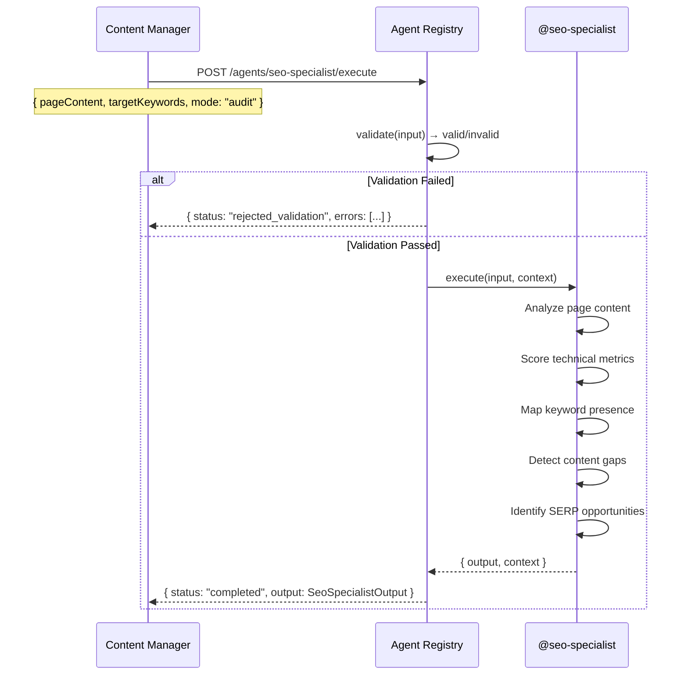

# Flow: Single Agent — @seo-specialist Audits a Blog Post

**Pattern:** `@seo-specialist` (standalone)

**Purpose:** A content manager or developer sends a blog post to the SEO specialist for a full technical and content audit before publishing.

## Sequence Diagram



## Request

```json
{
  "agent": "seo-specialist",
  "input": {
    "url": "https://example.com/blog/ultimate-guide-to-organic-skincare",
    "pageContent": "# Ultimate Guide to Organic Skincare\n\nOrganic skincare is more than a trend...\n\n## Why Choose Organic Skincare?\n...\n\n## Key Ingredients to Look For\n...\n\n## How to Build a Routine\n...",
    "targetKeywords": [
      {
        "keyword": "organic skincare routine",
        "searchVolume": 5400,
        "keywordDifficulty": 58,
        "intent": "informational",
        "currentPosition": null
      },
      {
        "keyword": "best organic skincare products",
        "searchVolume": 9200,
        "keywordDifficulty": 71,
        "intent": "commercial",
        "currentPosition": null
      }
    ],
    "technicalMetrics": {
      "coreWebVitals": {
        "lcpMobile": 3.2,
        "lcpDesktop": 2.1,
        "inpMobile": 185,
        "inpDesktop": 95,
        "clsMobile": 0.15,
        "clsDesktop": 0.05,
        "lcpPass": false,
        "inpPass": true,
        "clsPass": false
      },
      "mobile": {
        "mobileFriendly": true,
        "viewportConfigured": true,
        "touchTargetsAdequate": true,
        "fontLegible": true
      }
    },
    "mode": "audit"
  },
  "traceId": "audit-blog-001"
}
```

## Response

```json
{
  "agent": "seo-specialist",
  "status": "completed",
  "output": {
    "timestamp": "2026-06-11T16:30:00.000Z",
    "sourceAgent": "seo-specialist",
    "traceId": "audit-blog-001",
    "status": "completed",
    "summary": "SEO audit complete for https://example.com/blog/ultimate-guide-to-organic-skincare. Overall score: 55/100. Found 5 recommendations (1 critical, 3 high), 3 technical fixes (1 critical, 2 high), 0 keyword gaps.",
    "recommendations": [
      {
        "id": "rec-1",
        "category": "performance",
        "priority": "critical",
        "confidence": "high",
        "title": "LCP exceeds recommended threshold",
        "description": "LCP is 3.2s on mobile (target: <2.5s). Largest Contentful Paint delay impacts both UX and ranking.",
        "expectedImpact": "Core Web Vitals eligibility, potential ranking boost.",
        "implementationEffort": "medium",
        "estimatedTimeToImpact": "2–6 weeks",
        "relevantKeywords": []
      },
      {
        "id": "rec-2",
        "category": "keyword_strategy",
        "priority": "high",
        "confidence": "high",
        "title": "Commercial intent keyword missing from content",
        "description": "'Best organic skincare products' (9,200/mo, commercial intent) does not appear in any heading. Add a product recommendation section targeting this keyword.",
        "expectedImpact": "Capture SERP features for commercial queries.",
        "implementationEffort": "low",
        "estimatedTimeToImpact": "2–4 weeks",
        "relevantKeywords": ["best organic skincare products"]
      },
      {
        "id": "rec-3",
        "category": "on_page",
        "priority": "high",
        "confidence": "high",
        "title": "Primary keyword missing from H1",
        "description": "The H1 'Ultimate Guide to Organic Skincare' does not include 'routine' — the primary target keyword.",
        "expectedImpact": "Moderate ranking lift for primary keyword.",
        "implementationEffort": "low",
        "estimatedTimeToImpact": "2–4 weeks",
        "relevantKeywords": ["organic skincare routine"]
      },
      {
        "id": "rec-4",
        "category": "structured_data",
        "priority": "high",
        "confidence": "medium",
        "title": "No structured data detected",
        "description": "Page lacks Article, FAQ, and HowTo schema markup. Adding these enables rich results in SERPs.",
        "expectedImpact": "Rich result eligibility (FAQ snippet, article enhancement).",
        "implementationEffort": "low",
        "estimatedTimeToImpact": "1–2 weeks",
        "relevantKeywords": []
      },
      {
        "id": "rec-5",
        "category": "performance",
        "priority": "medium",
        "confidence": "medium",
        "title": "CLS exceeds stability threshold",
        "description": "CLS is 0.15 (target: <0.1). Layout shifts may degrade user experience.",
        "expectedImpact": "Improved user experience.",
        "implementationEffort": "medium",
        "estimatedTimeToImpact": "2–4 weeks",
        "relevantKeywords": []
      }
    ],
    "contentOptimizations": [
      {
        "id": "opt-1",
        "type": "title_tag",
        "priority": "high",
        "currentValue": "Ultimate Guide to Organic Skincare",
        "suggestedValue": "Organic Skincare Routine — The Ultimate Guide | Brand",
        "rationale": "Title tag is the strongest on-page ranking signal. Front-loading 'organic skincare routine' signals relevance to search engines."
      },
      {
        "id": "opt-2",
        "type": "keyword_integration",
        "priority": "high",
        "currentValue": "Keyword 'best organic skincare products' not found in content.",
        "suggestedValue": "Add a 'Best Organic Skincare Products' H2 section with product recommendations and comparison table.",
        "rationale": "Commercial intent keyword with 9,200 monthly searches is entirely missing."
      },
      {
        "id": "opt-3",
        "type": "keyword_integration",
        "priority": "medium",
        "currentValue": "Keyword 'organic skincare routine' appears 1 time in body.",
        "suggestedValue": "Include in H1 and at least 2 subheadings.",
        "rationale": "Low presence for the primary informational target."
      },
      {
        "id": "opt-4",
        "type": "structured_data",
        "priority": "high",
        "currentValue": "No schema detected.",
        "suggestedValue": "Add Article schema (with author, datePublished, dateModified). Add FAQ schema if Q&A section is added.",
        "rationale": "Enables rich results and eligibility for AI-powered SERP features."
      }
    ],
    "technicalFixes": [
      {
        "id": "fix-1",
        "severity": "critical",
        "priority": "critical",
        "category": "core_web_vitals",
        "issue": "LCP too slow (3.2s mobile)",
        "currentValue": "3.2s",
        "expectedValue": "<2.5s",
        "fixInstructions": "Optimize LCP element: (1) Identify the largest content element (likely the hero image). (2) Convert to WebP, compress below 100KB. (3) Add fetchpriority='high' attribute. (4) Implement lazy loading for below-fold images."
      },
      {
        "id": "fix-2",
        "severity": "high",
        "priority": "high",
        "category": "core_web_vitals",
        "issue": "CLS too high (0.15 mobile)",
        "currentValue": "0.15",
        "expectedValue": "<0.1",
        "fixInstructions": "Fix layout stability: (1) Set explicit width/height on all images. (2) Reserve space for any embedded content or ads. (3) Ensure fonts don't trigger layout shifts (font-display: swap with matching fallback metrics)."
      },
      {
        "id": "fix-3",
        "severity": "high",
        "priority": "high",
        "category": "structured_data",
        "issue": "No structured data present",
        "currentValue": "0 schema types",
        "expectedValue": "Article + BreadcrumbList + FAQ (if applicable)",
        "fixInstructions": "Implement Article schema with JSON-LD: include headline, author, datePublished, dateModified, publisher, image. Add BreadcrumbList schema for navigation context."
      }
    ],
    "keywordGapAnalysis": [],
    "linkOpportunities": [],
    "serpFeatureOpportunities": [
      {
        "featureType": "featured_snippet",
        "keyword": "organic skincare routine",
        "currentOwner": "healthline.com",
        "captureStrategy": "Provide a concise 40–50 word answer defining 'organic skincare routine' at the top of the article, followed by a numbered step list. Structure with clear H2 subheadings for each step.",
        "priority": "high",
        "confidence": "medium"
      },
      {
        "featureType": "people_also_ask",
        "keyword": "organic skincare routine",
        "currentOwner": "multiple",
        "captureStrategy": "Add an FAQ section answering 'What is an organic skincare routine?', 'How to start organic skincare?', 'Best products for organic skincare routine?'. Mark up with FAQ schema.",
        "priority": "medium",
        "confidence": "high"
      }
    ],
    "overallSeoScore": 55
  },
  "context": {
    "seoAudit": { "...": "full output object" },
    "keywordMap": {
      "organic skincare routine": {
        "targetUrl": "https://example.com/blog/ultimate-guide-to-organic-skincare",
        "intent": "informational",
        "volume": 5400,
        "difficulty": 58,
        "currentPosition": null,
        "owner": "pillar"
      },
      "best organic skincare products": {
        "targetUrl": "https://example.com/blog/ultimate-guide-to-organic-skincare",
        "intent": "commercial",
        "volume": 9200,
        "difficulty": 71,
        "currentPosition": null,
        "owner": "satellite"
      }
    },
    "contentOptimizations": {
      "(current-page)": ["opt-1", "opt-2", "opt-3", "opt-4"]
    },
    "technicalFixes": {
      "core_web_vitals": ["fix-1", "fix-2"],
      "structured_data": ["fix-3"]
    },
    "linkOpportunities": []
  },
  "metrics": {
    "durationMs": 2847,
    "model": "seo-analyzer-v1"
  }
}
```

## Use Case

A content manager pastes a draft blog post (as markdown) and a keyword list into the SEO specialist before publishing. The agent returns a structured audit with prioritized fixes, allowing the team to address critical issues (LCP, missing keyword) before the post goes live.
