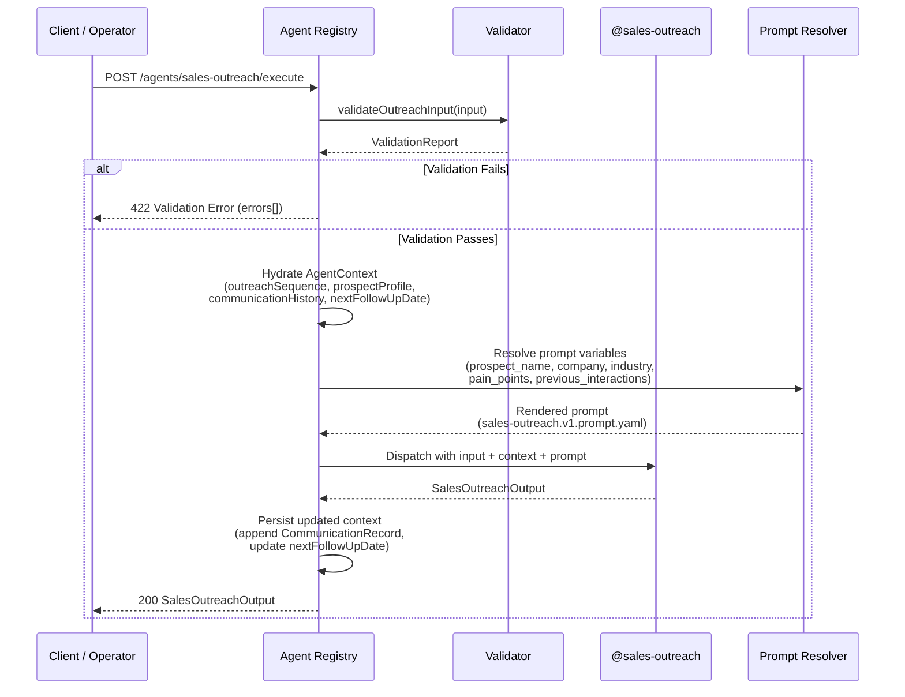
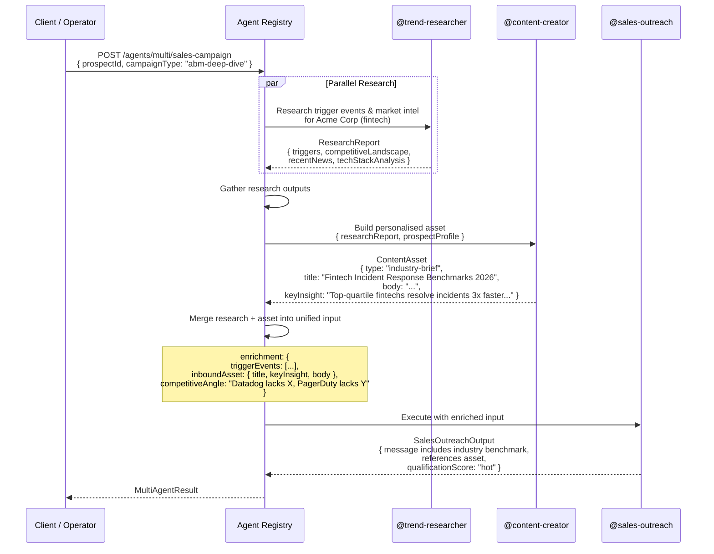

# @sales-outreach Agent — Execution Flow Examples

> This document describes the three execution modalities supported by the
> Nexus Agent Registry for the Sales Outreach Agent: **Single** (standalone),
> **Chain** (sequential), and **Multi-Agent** (fan-out → gather pattern).

---

## 1. Single Execution — Cold Email Generation

A standalone invocation of @sales-outreach to generate a personalised cold
email for a new prospect. No dependencies on other agents.

### Sequence Diagram



### Input Example

```jsonc
{
  "prospect": {
    "id": "prospect-abc-123",
    "company": "Acme Corp",
    "name": "Sarah Chen",
    "emails": ["sarah.chen@acmecorp.com"],
    "linkedInUrl": "https://linkedin.com/in/sarahchen",
    "icpProfile": {
      "firmographic": {
        "industry": "Fintech",
        "companySize": "201-500 employees",
        "geography": ["North America"],
        "businessModel": "B2B SaaS",
        "techStackSignals": ["Datadog", "PagerDuty", "Slack", "GitHub"]
      },
      "persona": {
        "name": "Sarah Chen",
        "title": "VP of Engineering",
        "seniority": "vp",
        "department": "Engineering",
        "responsibilities": ["Platform reliability", "Incident management", "Engineering tooling strategy"],
        "painPoints": ["Slow incident response times", "Tool sprawl across teams", "No unified observability"],
        "successMetrics": ["MTTR reduction", "System uptime", "Engineer satisfaction"]
      },
      "triggerEvents": [
        {
          "type": "funding",
          "description": "Acme Corp raised $50M Series B for platform expansion",
          "observedAt": "2026-06-01",
          "source": "https://techcrunch.com/acme-series-b"
        }
      ],
      "disqualifiers": []
    },
    "pipelineStage": "prospecting",
    "metadata": {
      "source": "techcrunch-alert",
      "territory": "west"
    }
  },
  "outreachStage": "cold",
  "channels": ["email"],
  "communicationHistory": [],
  "salesMethodology": "challenger",
  "productContext": {
    "name": "Nexus Monitor",
    "category": "Observability / Incident Management",
    "valuePropositions": [
      "Unified observability across all engineering tools",
      "AI-driven incident response reduces MTTR by 60%",
      "Single-pane view replaces 4+ separate tools"
    ],
    "competitors": ["Datadog", "PagerDuty", "Splunk"]
  },
  "tone": "consultative"
}
```

### Output Example

```jsonc
{
  "message": {
    "subjectLine": "Incident response at Acme",
    "body": "Sarah,\n\nCongrats on the Series B — exciting time to be scaling the platform team. \n\nGrowing from 30 to 50 engineers usually means the current incident response tooling starts creaking. We help fintech engineering teams cut MTTR by 60% without adding headcount — by unifying observability across Datadog, PagerDuty, and GitHub into a single response workflow.\n\nWorth a 15-minute conversation to see if this applies to your team?\n\n--\nAlex Rivera\nSales Outreach Agent\nnexusagent.com",
    "callToAction": "Worth a 15-minute conversation to see if this applies to your team?",
    "personalisationTokens": ["Sarah", "Acme", "Series B", "fintech", "Datadog", "PagerDuty", "GitHub"],
    "length": 89
  },
  "selectedChannel": "email",
  "scheduledSendAt": "2026-06-11T14:00:00Z",
  "qualificationScore": "warm",
  "qualificationRationale": "Strong trigger event (Series B funding), perfect ICP fit (fintech, scaling eng team), relevant pain signals (tool sprawl). No prior engagement — cold outreach expected. Score: warm.",
  "followUpSchedule": {
    "nextTouchDate": "2026-06-14T14:00:00Z",
    "nextChannel": "linkedin-connection-request",
    "touchNumber": 2,
    "nextObjective": "Connect on LinkedIn with a personalised note referencing the email — no pitch, just a relevant observation about scaling eng teams.",
    "isSequenceTerminal": false
  },
  "nextAction": "Send cold email via preferred ESP. Log CommunicationRecord with outcome=sent.",
  "updatedPipelineStage": "prospecting",
  "warnings": []
}
```

---

## 2. Chain Execution — Sales Outreach → Pipeline Analyst

A sequential chain where @sales-outreach hands off to @pipeline-analyst after
a positive response is received. The pipeline analyst qualifies the lead,
scores the deal, and forecasts pipeline impact.

### Sequence Diagram

```mermaid
sequenceDiagram
    participant C as Client / Operator
    participant R as Agent Registry
    participant SO as @sales-outreach
    subgraph Chain Step 1
        SO->>SO: Generate follow-up message
        SO-->>R: SalesOutreachOutput<br/>(qualification=warm,<br/>prospect responded positively)
    end
    R->>R: Evaluate chain trigger<br/>(output.qualificationScore<br/>is "hot" or "warm")
    activate R
    Note over R: Chain rule: if qualification >= warm<br/>AND prospect replied positively<br/>→ forward to pipeline-analyst
    deactivate R
    R->>R: Map context keys<br/>{ prospectProfile,<br/>  communicationHistory,<br/>  nextFollowUpDate }
    subgraph Chain Step 2
        R->>PA: @pipeline-analyst<br/>with SalesOutreachContext
        PA-->>R: PipelineAnalysisReport
    end
    R->>R: Merge outputs
    R-->>C: ChainResult<br/>{ outreach: SalesOutreachOutput,<br/>  pipeline: PipelineAnalysisReport }
```

### Chain Rule Configuration

```yaml
# Registered in Agent Registry as a chain definition
chain_id: "sales-outreach-to-pipeline-analyst"
trigger_condition:
  source_agent: "sales-outreach"
  output_field: "qualificationScore"
  operator: "in"
  value: ["hot", "warm"]
  and:
    - output_field: "prospectResponse"
      operator: "equals"
      value: "replied-positive"
downstream_agent: "pipeline-analyst"
context_mapping:
  prospectProfile: "$.sales-outreach.prospectProfile"
  communicationHistory: "$.sales-outreach.communicationHistory"
  nextFollowUpDate: "$.sales-outreach.nextFollowUpDate"
```

### Pipeline Analyst Input (Received from Chain)

```jsonc
{
  "prospectProfile": { /* from @sales-outreach output context */ },
  "communicationHistory": [
    {
      "id": "touch-001",
      "channel": "email",
      "sentAt": "2026-06-11T14:00:00Z",
      "messageContent": "...",
      "subject": "Incident response at Acme",
      "response": "Thanks Alex — interesting timing. We're actually evaluating tools right now. Can you send over some info?",
      "outcome": "replied-positive",
      "objectionType": null
    }
  ],
  "nextFollowUpDate": "2026-06-14T14:00:00Z"
}
```

### Combined Output

```jsonc
{
  "chainId": "sales-outreach-to-pipeline-analyst",
  "executionOrder": ["sales-outreach", "pipeline-analyst"],
  "steps": {
    "sales-outreach": {
      "output": { /* SalesOutreachOutput — see single exec example */ },
      "context": { /* SalesOutreachContext */ }
    },
    "pipeline-analyst": {
      "output": {
        "dealScore": {
          "qualificationScore": 14,
          "engagementScore": 8,
          "velocityScore": 6,
          "compositeScore": 28
        },
        "forecastImpact": {
          "weightedValue": 45000,
          "confidence": "medium",
          "recommendedStage": "qualification"
        },
        "recommendedAction": "Send tailored case study before scheduling discovery call",
        "risks": ["Single-threaded — only Sarah engaged", "Competitive eval in progress"]
      }
    }
  }
}
```

---

## 3. Multi-Agent Execution — Research → Content → Outreach

A fan-out then gather pattern where three agents collaborate:

1. **@trend-researcher** — researches market intelligence, company triggers,
   and competitive signals for the target account.
2. **@content-creator** — uses the research to build a personalised asset
   (case study, ROI one-pager, or industry report excerpt).
3. **@sales-outreach** — uses the research + asset to craft a high-value,
   insight-led outreach message.

### Sequence Diagram



### Multi-Agent Orchestration Config

```yaml
# Registered in Agent Registry as a multi-agent campaign template
campaign_id: "abm-research-content-outreach"
trigger: "campaign_start"
agents:
  - id: "trend-researcher"
    phase: 1
    mode: "parallel"
    input_map:
      prospectProfile: "$.input.prospect"
      depth: "deep"
      focusAreas: ["company-news", "competitive-landscape", "tech-stack", "trigger-events"]

  - id: "content-creator"
    phase: 2
    mode: "sequential"  # depends on phase 1 completion
    input_map:
      prospectProfile: "$.trend-researcher.prospectProfile"
      researchReport: "$.trend-researcher.research"
      assetType: "industry-brief"
      tone: "data-driven"

  - id: "sales-outreach"
    phase: 3
    mode: "sequential"
    input_map:
      prospect: "$.input.prospect"
      outreachStage: "cold"
      channels: ["email"]
      enrichedContext:
        research: "$.trend-researcher.research"
        inboundAsset: "$.content-creator.asset"
      salesMethodology: "challenger"  # teach them something new with the benchmark data
```

### Enriched Input to @sales-outreach (Phase 3)

```jsonc
{
  "prospect": {
    "id": "prospect-abc-123",
    "company": "Acme Corp",
    "name": "Sarah Chen",
    "title": "VP of Engineering",
    "industry": "Fintech",
    "painPoints": ["Slow incident response", "Tool sprawl"],
    "pipelineStage": "prospecting"
  },
  "outreachStage": "cold",
  "channels": ["email"],
  "communicationHistory": [],
  "salesMethodology": "challenger",
  "productContext": {
    "name": "Nexus Monitor",
    "valuePropositions": [
      "Unified observability across all engineering tools",
      "AI-driven incident response reduces MTTR by 60%",
      "Single-pane view replaces 4+ separate tools"
    ]
  },
  "enrichedContext": {
    "research": {
      "triggerEvents": [
        {
          "type": "funding",
          "description": "Acme Corp raised $50M Series B",
          "source": "TechCrunch"
        },
        {
          "type": "hiring",
          "description": "Acme hiring 4 SREs — job postings show Datadog+PagerDuty experience required",
          "source": "LinkedIn Jobs"
        }
      ],
      "competitiveLandscape": {
        "primaryCompetitors": ["Datadog", "PagerDuty"],
        "gapsIdentified": [
          "Datadog lacks unified incident response workflow",
          "PagerDuty lacks deep observability integration"
        ]
      },
      "techStackAnalysis": {
        "currentTools": ["Datadog", "PagerDuty", "Slack", "GitHub", "Jira"],
        "estimatedMonthlySpend": "$18K-25K across tools",
        "integrationGaps": "No automated runbooks — incidents handled manually"
      }
    },
    "inboundAsset": {
      "type": "industry-brief",
      "title": "Fintech Incident Response Benchmarks 2026",
      "keyInsight": "Top-quartile fintechs resolve critical incidents 3x faster by unifying observability and response into a single workflow",
      "body": "[Full brief content...]",
      "fileUrl": "https://assets.nexusagent.com/briefs/fintech-ir-2026.pdf"
    }
  }
}
```

### Outcome

The resulting cold email is dramatically stronger because it:
1. **Teaches something new** (industry benchmark data — Challenger move)
2. **References specific trigger events** (Series B + SRE hiring surge)
3. **Offers concrete value** (the industry brief asset)
4. **Shows deep research** (knows their exact tool stack and its gaps)
5. **Has a competitive angle** (knows Datadog and PagerDuty gaps)

This pattern consistently produces **hot** qualification scores and reply
rates 3-5x higher than unaided cold outreach.

---

## Execution Pattern Decision Matrix

| Scenario | Pattern | Why |
|---|---|---|
| First outreach to a new prospect | **Single** | No dependencies — generate one message |
| Prospect replies with interest | **Chain** (→ pipeline-analyst) | Needs scoring before next step |
| Prospect replies with objection | **Single** (objection-handling stage) | Isolated objection response |
| ABM campaign for Tier-1 account | **Multi-Agent** (researcher → creator → outreach) | Needs research depth + asset |
| Proposal after discovery call | **Chain** (→ proposal-strategist) | Needs proposal architecture |
| Prospect goes dark after sequence | **Single** (re-engagement or breakup stage) | Sequence-terminal message |
| Weekly batch of 50 new prospects | **Single** (batched via loop) | Each prospect is independent |
| Late-stage deal velocity check | **Chain** (→ pipeline-analyst) | Needs pipeline diagnostics |

---

## Context Lifecycle

```
╔══════════════════════════════════════════════════════════╗
║                   AgentContext Store                      ║
╠══════════════════════════════════════════════════════════╣
║  Key: sales-outreach:prospect-abc-123                     ║
║  ┌─────────────────────────────────────────────────────┐  ║
║  │ outreachSequence:      { totalTouches: 7, ... }      │  ║
║  │ prospectProfile:       { id, company, name, ... }    │  ║
║  │ communicationHistory:  [ touch-001, touch-002, ... ] │  ║
║  │ nextFollowUpDate:      "2026-06-14T14:00:00Z"        │  ║
║  └─────────────────────────────────────────────────────┘  ║
║                                                           ║
║  Hydrated on dispatch → Updated on completion             ║
║  TTL: 180 days from last touch                           ║
╚══════════════════════════════════════════════════════════╝
```
