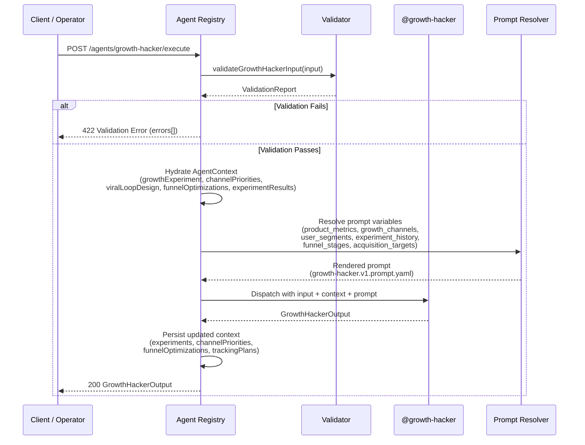
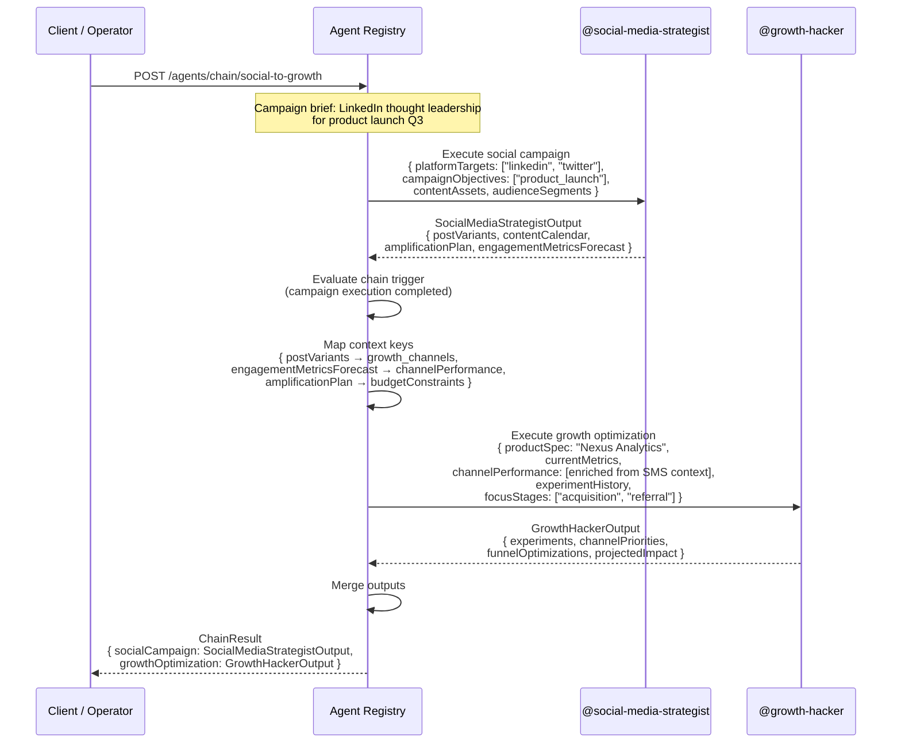
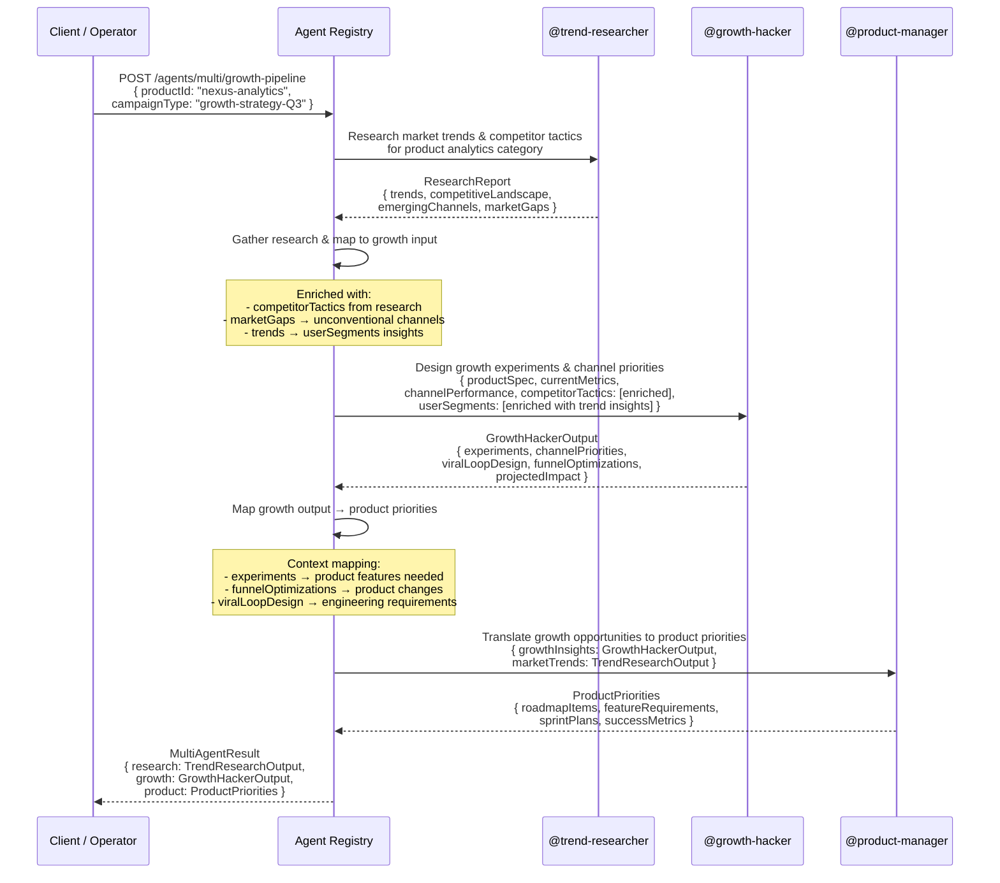

# @growth-hacker Agent — Execution Flow Examples

> This document describes the three execution modalities supported by the
> Nexus Agent Registry for the Growth Hacker agent: **Single** (standalone),
> **Chain** (sequential), and **Multi-Agent** (fan-out → gather pattern).

---

## 1. Single Execution — AARRR Funnel Experiment Design

A standalone invocation of @growth-hacker to design a full AARRR funnel
experiment. The agent analyzes current metrics, identifies the highest-leverage
stage, and produces a complete experiment ready for launch.

### Sequence Diagram



### Input Example

```jsonc
{
  "productSpec": {
    "name": "Nexus Analytics Dashboard",
    "description": "Real-time analytics dashboard for SaaS product teams",
    "targetUserSegment": "SaaS product managers and data analysts",
    "keyValueProposition": "Unified product analytics without SQL — 10x faster insights",
    "activationTriggers": [
      "User imports their first data source",
      "User creates their first dashboard",
      "User shares a dashboard with a teammate"
    ],
    "sharingMechanisms": ["Dashboard share link", "Automated report email", "Team invite"]
  },
  "currentMetrics": {
    "acquisition": {
      "newUsers": 15000,
      "topChannels": {
        "paid-search": 5000,
        "paid-social": 4000,
        "content-marketing": 3000,
        "seo": 1500,
        "referral": 1000,
        "viral": 500
      },
      "costPerAcquisition": {
        "paid-search": 45.00,
        "paid-social": 38.00,
        "content-marketing": 22.00,
        "seo": 8.00,
        "referral": 12.00,
        "viral": 3.00
      },
      "totalAcquisitionCost": 525000
    },
    "activation": {
      "activatedUsers": 6000,
      "activationRate": 0.40,
      "timeToActivation": 540,
      "activationTriggers": [
        "Data source imported (55% of activated)",
        "First dashboard created (30%)",
        "Dashboard shared (15%)"
      ]
    },
    "retention": {
      "day1Retention": 0.55,
      "day7Retention": 0.32,
      "day30Retention": 0.18,
      "day90Retention": 0.10,
      "churnRate": 0.08
    },
    "revenue": {
      "monthlyRecurringRevenue": 320000,
      "averageRevenuePerUser": 21.33,
      "lifetimeValue": 210,
      "paybackPeriodDays": 135,
      "expansionRevenue": 48000
    },
    "referral": {
      "invitesSent": 3200,
      "inviteConversionRate": 0.28,
      "viralCoefficient": 0.45,
      "referralRevenue": 45000
    }
  },
  "userSegments": [
    {
      "id": "seg-power-users",
      "name": "Power Users",
      "description": "Users who create 5+ dashboards and log in daily",
      "userCount": 3200,
      "acquisitionChannels": ["content-marketing", "seo", "referral"],
      "activationRate": 0.78,
      "retentionRateD30": 0.65,
      "averageRevenuePerUser": 48.00,
      "lifetimeValue": 520,
      "commonBehaviors": ["Daily login", "Shares dashboards", "Invites teammates"],
      "painPoints": ["Want real-time data refresh", "Need more visualization types"]
    },
    {
      "id": "seg-evaluators",
      "name": "Trial Evaluators",
      "description": "Users in free trial who haven't activated",
      "userCount": 4500,
      "acquisitionChannels": ["paid-search", "paid-social"],
      "activationRate": 0.18,
      "retentionRateD30": 0.05,
      "averageRevenuePerUser": 0,
      "lifetimeValue": 0,
      "commonBehaviors": ["Signed up", "Logged in 1-2 times", "Never imported data"],
      "painPoints": ["Too complex to set up", "Don't see value quickly enough"]
    }
  ],
  "channelPerformance": [
    {
      "channel": "paid-search",
      "period": "2026-Q2",
      "spend": 225000,
      "impressions": 3800000,
      "clicks": 68000,
      "conversions": 5000,
      "costPerAcquisition": 45.00,
      "conversionRate": 0.074,
      "attributedRevenue": 315000,
      "returnOnAdSpend": 1.4,
      "qualityScore": 7
    },
    {
      "channel": "content-marketing",
      "period": "2026-Q2",
      "spend": 66000,
      "impressions": 1200000,
      "clicks": 24000,
      "conversions": 3000,
      "costPerAcquisition": 22.00,
      "conversionRate": 0.125,
      "attributedRevenue": 198000,
      "returnOnAdSpend": 3.0,
      "qualityScore": 9
    },
    {
      "channel": "referral",
      "period": "2026-Q2",
      "spend": 12000,
      "impressions": 0,
      "clicks": 0,
      "conversions": 1000,
      "costPerAcquisition": 12.00,
      "conversionRate": 0.28,
      "attributedRevenue": 45000,
      "returnOnAdSpend": 3.75,
      "qualityScore": 8
    },
    {
      "channel": "viral",
      "period": "2026-Q2",
      "spend": 1500,
      "impressions": 80000,
      "clicks": 4500,
      "conversions": 500,
      "costPerAcquisition": 3.00,
      "conversionRate": 0.11,
      "attributedRevenue": 12000,
      "returnOnAdSpend": 8.0,
      "qualityScore": 6
    }
  ],
  "experimentHistory": [
    {
      "id": "exp-001",
      "name": "Free Trial Length Extension",
      "hypothesis": "Extending free trial from 7 to 14 days will increase activation rate by 15%",
      "targetFunnelStage": "activation",
      "channel": "product-led",
      "variantName": "14-day trial",
      "controlName": "7-day trial",
      "startDate": "2026-04-01",
      "endDate": "2026-04-28",
      "sampleSize": 2400,
      "metricName": "activation_rate",
      "controlValue": 0.40,
      "variantValue": 0.43,
      "absoluteLift": 0.03,
      "relativeLift": 0.075,
      "pValue": 0.04,
      "significanceLevel": 0.05,
      "status": "won",
      "winnerName": "14-day trial",
      "learnings": [
        "7.5% lift achieved but below 15% hypothesis",
        "Enterprise segment showed 12% lift vs. SMB 4%",
        "Trial-to-paid conversion unchanged"
      ],
      "followUpActions": [
        "Implement 14-day trial for enterprise segment only",
        "Test guided onboarding during trial for SMBs"
      ]
    },
    {
      "id": "exp-002",
      "name": "Referral Incentive Increase",
      "hypothesis": "Increasing referral reward from $10 to $25 will increase invite volume by 50%",
      "targetFunnelStage": "referral",
      "channel": "referral",
      "variantName": "$25 reward",
      "controlName": "$10 reward",
      "startDate": "2026-05-01",
      "endDate": "2026-05-21",
      "sampleSize": 800,
      "metricName": "invites_per_user",
      "controlValue": 0.45,
      "variantValue": 0.52,
      "absoluteLift": 0.07,
      "relativeLift": 0.156,
      "pValue": 0.12,
      "significanceLevel": 0.05,
      "status": "inconclusive",
      "learnings": [
        "15.6% lift observed but not statistically significant (p=0.12)",
        "Trend suggests effect may exist — need larger sample",
        "Cost per acquired user increased from $12 to $15"
      ],
      "followUpActions": [
        "Re-run with higher sample size (n=2,000 per variant)",
        "Consider non-monetary incentives (feature access)"
      ]
    }
  ],
  "competitorTactics": [
    {
      "competitorName": "Mixpanel",
      "tacticDescription": "Free forever tier for up to 20M events/month — land and expand",
      "channel": "product-led",
      "estimatedImpact": "High — captures SMBs who later upgrade",
      "evidence": "Public pricing page, G2 reviews mention generous free tier",
      "confidence": "high",
      "applicableToUs": true,
      "adaptationSuggestion": "Introduce a free-forever tier capped at 3 dashboards to improve activation funnel top"
    },
    {
      "competitorName": "Amplitude",
      "tacticDescription": "Amplitude Academy — free certification program driving organic signups",
      "channel": "content-marketing",
      "estimatedImpact": "Medium — long-term brand and authority builder",
      "evidence": "1,500+ certified practitioners, LinkedIn growth",
      "confidence": "medium",
      "applicableToUs": true,
      "adaptationSuggestion": "Launch 'Nexus Analytics Certification' — free course driving qualified signups"
    }
  ],
  "focusStages": ["acquisition", "activation", "referral"],
  "acquisitionTargets": {
    "newUsersTarget": 50000,
    "targetCac": 35.00,
    "targetLtvCacRatio": 3.5,
    "targetPaybackPeriodDays": 150
  },
  "totalExperimentBudget": 500000,
  "budgetConstraints": {
    "paid-search": 200000,
    "paid-social": 150000,
    "content-marketing": 100000,
    "viral": 30000,
    "referral": 50000,
    "unconventional": 20000
  },
  "minimumDetectableEffect": 0.05,
  "significanceThreshold": 0.05,
  "statisticalPower": 0.80
}
```

### Output Example

```jsonc
{
  "experiments": [
    {
      "experimentId": "exp-gh-001",
      "name": "Guided Onboarding Wizard vs. Self-Serve",
      "hypothesis": "If we replace the current self-serve onboarding with a guided 4-step wizard, activation rate will increase from 40% to 48% because users reach their first dashboard faster with structured guidance.",
      "targetFunnelStage": "activation",
      "channel": "product-led",
      "controlName": "Self-serve onboarding (current)",
      "variantName": "Guided 4-step wizard",
      "controlDescription": "Users sign up and are dropped into an empty dashboard with tooltips and documentation links.",
      "variantDescription": "Users are guided through a sequential 4-step wizard: (1) Connect data source, (2) Define key metric, (3) Create first dashboard, (4) Share with team.",
      "primaryMetric": {
        "name": "Activation rate (% users who complete core action within 7 days)",
        "type": "binomial",
        "currentBaseline": 0.40,
        "minimumDetectableEffect": 0.05,
        "expectedLift": 0.08
      },
      "secondaryMetrics": [
        {
          "name": "Time-to-activation (seconds)",
          "type": "continuous",
          "currentBaseline": 540,
          "guardrailThreshold": 360
        },
        {
          "name": "D7 retention rate",
          "type": "binomial",
          "currentBaseline": 0.32,
          "guardrailThreshold": 0.28
        },
        {
          "name": "Support ticket volume (onboarding related)",
          "type": "count",
          "currentBaseline": 120,
          "guardrailThreshold": 150
        }
      ],
      "sampleSizeRequired": 2080,
      "estimatedDurationDays": 14,
      "trafficAllocation": 0.50,
      "riskLevel": "medium",
      "segmentationPlan": "Stratified by segment (power users vs. trial evaluators) and acquisition channel (organic vs. paid).",
      "guardrailMetrics": [
        "D7 retention rate",
        "Support ticket volume",
        "Time-to-activation"
      ],
      "stopConditions": [
        "Stop early if guardrail metric D7 retention drops below 28% for 3 consecutive days",
        "Stop early if variant shows >2% reduction in signup completion rate",
        "Maximum duration 21 days regardless of significance"
      ],
      "trackingImplementation": "Instrument onboarding wizard with Mixpanel event tracking. Log step-by-step completion. Set up Amplitude funnel analysis. Configure Datadog alert on support ticket spike."
    },
    {
      "experimentId": "exp-gh-002",
      "name": "Team Collaboration Trigger in Activation Flow",
      "hypothesis": "If we prompt users to invite a teammate immediately after creating their first dashboard, referral rate will increase from 28% to 40% because users see immediate collaboration value.",
      "targetFunnelStage": "referral",
      "channel": "viral",
      "controlName": "No invite prompt in activation flow",
      "variantName": "Post-dashboard invite prompt + sharing preview",
      "controlDescription": "Users can find the 'Invite team' button in settings after activation.",
      "variantDescription": "Immediately after a user creates their first dashboard, a modal appears: 'Share this dashboard with your team — see how they interact.' Includes preview of teammate's view.",
      "primaryMetric": {
        "name": "Invite conversion rate (% of activated users who send at least 1 invite)",
        "type": "binomial",
        "currentBaseline": 0.28,
        "minimumDetectableEffect": 0.05,
        "expectedLift": 0.12
      },
      "secondaryMetrics": [
        {
          "name": "Invites per activated user",
          "type": "ratio",
          "currentBaseline": 0.45,
          "guardrailThreshold": 0.30
        },
        {
          "name": "Invitee activation rate",
          "type": "binomial",
          "currentBaseline": 0.40,
          "guardrailThreshold": 0.30
        }
      ],
      "sampleSizeRequired": 1650,
      "estimatedDurationDays": 14,
      "trafficAllocation": 0.50,
      "riskLevel": "low",
      "segmentationPlan": "Segmented by team size (solo vs. 2-5 vs. 5+ team members).",
      "guardrailMetrics": [
        "Invitee activation rate",
        "Overall activation rate (ensure invite prompt doesn't distract)",
        "Modal dismissal rate"
      ],
      "stopConditions": [
        "Stop if modal dismissal rate exceeds 60%",
        "Stop if invitee activation drops below 30%",
        "Maximum duration 21 days"
      ],
      "trackingImplementation": "Track modal impression, acceptance, invite sent, invitee signup via Mixpanel. Analyze cohort of invitees for activation funnel."
    }
  ],
  "channelPriorities": [
    {
      "channel": "viral",
      "priorityScore": 88,
      "rank": 1,
      "estimatedCac": 3.00,
      "estimatedLtv": 210,
      "estimatedReach": 15000,
      "scalability": "high",
      "timeToScale": "3 months",
      "confidence": "medium",
      "rationale": "Near-zero marginal CAC with viral coefficient improvement. Current k=0.45 can grow to 0.85 through team-collaboration triggers. Highest long-term ROI potential.",
      "budgetAllocation": 30000,
      "expectedNewUsers": 8000,
      "expectedRoi": 8.0
    },
    {
      "channel": "referral",
      "priorityScore": 82,
      "rank": 2,
      "estimatedCac": 12.00,
      "estimatedLtv": 210,
      "estimatedReach": 20000,
      "scalability": "high",
      "timeToScale": "2 months",
      "confidence": "high",
      "rationale": "Strong historical performance (28% invite conversion). CAC $12 well below target of $35. Proven channel with room to scale through incentive optimization.",
      "budgetAllocation": 50000,
      "expectedNewUsers": 4000,
      "expectedRoi": 3.75
    },
    {
      "channel": "content-marketing",
      "priorityScore": 76,
      "rank": 3,
      "estimatedCac": 22.00,
      "estimatedLtv": 210,
      "estimatedReach": 30000,
      "scalability": "high",
      "timeToScale": "6 months",
      "confidence": "high",
      "rationale": "Strong ROAS (3.0x) with high-quality activated users. Content compounds over time. Competitor analysis shows certification program opportunity.",
      "budgetAllocation": 100000,
      "expectedNewUsers": 4500,
      "expectedRoi": 4.1
    },
    {
      "channel": "seo",
      "priorityScore": 70,
      "rank": 4,
      "estimatedCac": 8.00,
      "estimatedLtv": 210,
      "estimatedReach": 25000,
      "scalability": "high",
      "timeToScale": "9 months",
      "confidence": "medium",
      "rationale": "Currently underinvested. CAC $8 is well below target. Organic compounding channel. Requires 6-9 month build but highest long-term defensibility.",
      "budgetAllocation": 75000,
      "expectedNewUsers": 3500,
      "expectedRoi": 5.2
    },
    {
      "channel": "paid-search",
      "priorityScore": 64,
      "rank": 5,
      "estimatedCac": 42.00,
      "estimatedLtv": 210,
      "estimatedReach": 50000,
      "scalability": "low",
      "timeToScale": "immediate",
      "confidence": "high",
      "rationale": "Reliable volume but CAC at $42 exceeds $35 target. ROAS 1.4x below healthy threshold. Maintain for volume while building compound channels. Optimize keyword mix to reduce CAC.",
      "budgetAllocation": 170000,
      "expectedNewUsers": 4000,
      "expectedRoi": 1.4
    },
    {
      "channel": "paid-social",
      "priorityScore": 52,
      "rank": 6,
      "estimatedCac": 51.00,
      "estimatedLtv": 210,
      "estimatedReach": 40000,
      "scalability": "low",
      "timeToScale": "immediate",
      "confidence": "high",
      "rationale": "CAC $51 well above target. Low retention from this channel. Reduce spend and redirect to content marketing and referral. Consider creative refresh before increasing investment.",
      "budgetAllocation": 75000,
      "expectedNewUsers": 1500,
      "expectedRoi": 1.2
    }
  ],
  "viralLoopDesign": {
    "loopType": "invite",
    "loopDescription": "Team collaboration viral loop — existing users invite teammates to share dashboards, creating network effects within organizations.",
    "currentKFactor": 0.45,
    "targetKFactor": 0.85,
    "inviteMechanism": "Post-activation share prompt + in-product 'Share dashboard' button with teammate preview",
    "incentiveStructure": "Dual-sided: Inviter gets 1 month free (value $25), Invitee gets 50% off first 3 months (value $37.50)",
    "conversionSteps": [
      {
        "step": 1,
        "description": "User clicks 'Share dashboard' or responds to activation invite prompt",
        "currentConversion": 0.28,
        "targetConversion": 0.42,
        "optimizationLever": "Reduce friction — add one-click share with auto-generated preview"
      },
      {
        "step": 2,
        "description": "Invitee receives email/notification and opens invite link",
        "currentConversion": 0.62,
        "targetConversion": 0.75,
        "optimizationLever": "Personalize invite email with sender name, dashboard preview, and team context"
      },
      {
        "step": 3,
        "description": "Invitee signs up for account",
        "currentConversion": 0.68,
        "targetConversion": 0.80,
        "optimizationLever": "Pre-fill signup form from invite token, reduce required fields"
      },
      {
        "step": 4,
        "description": "Invitee activates (creates first dashboard)",
        "currentConversion": 0.40,
        "targetConversion": 0.60,
        "optimizationLever": "Import inviter's dashboard setup as template — invitee sees data immediately"
      }
    ],
    "viralCycleTime": "48 hours",
    "shareChannel": "email",
    "estimatedVirality": {
      "organicGrowthRate": 0.08,
      "paidRequired": false,
      "breakEvenKFactor": 1.0,
      "projectedKFactorAfter": 0.85
    },
    "implementationRequirements": [
      "Add 'Share dashboard' CTA in activated-state success modal",
      "Build invite email template with personalized preview",
      "Implement pre-filled signup from invite token",
      "Add dashboard template cloning for new invitees",
      "Set up invite tracking analytics (sent, opened, clicked, signed up)",
      "Implement dual-sided incentive fulfillment system"
    ]
  },
  "funnelOptimizations": [
    {
      "stage": "activation",
      "currentConversionRate": 0.40,
      "targetConversionRate": 0.50,
      "estimatedLift": 0.10,
      "recommendedActions": [
        "Implement guided onboarding wizard (experiment exp-gh-001)",
        "Reduce signup friction — allow Google SSO, remove optional fields",
        "Add data source templates for top 5 integrations",
        "Show value prop prominently during first 30 seconds"
      ],
      "effortEstimate": "medium",
      "impactEstimate": "high",
      "confidence": "high",
      "dependencies": ["Engineering for onboarding wizard", "Design for new flow"],
      "experimentationRequired": true,
      "quickWin": false
    },
    {
      "stage": "acquisition",
      "currentConversionRate": 0.074,
      "targetConversionRate": 0.09,
      "estimatedLift": 0.016,
      "recommendedActions": [
        "Shift 20% of paid-social budget to content marketing",
        "Add comparison landing pages (vs. Mixpanel, Amplitude)",
        "Implement competitor keyword bidding on search",
        "Optimize landing page CTA for different segments"
      ],
      "effortEstimate": "low",
      "impactEstimate": "medium",
      "confidence": "medium",
      "dependencies": ["Landing page copy update"],
      "experimentationRequired": true,
      "quickWin": true
    },
    {
      "stage": "referral",
      "currentConversionRate": 0.28,
      "targetConversionRate": 0.40,
      "estimatedLift": 0.12,
      "recommendedActions": [
        "Implement post-activation invite prompt (experiment exp-gh-002)",
        "Add team workspace creation as an activation step",
        "Double-sided incentive (inviter gets 1 month, invitee gets 50% off)",
        "Show team activity feed to demonstrate collaboration value"
      ],
      "effortEstimate": "medium",
      "impactEstimate": "high",
      "confidence": "medium",
      "dependencies": ["Invite prompt modal", "Incentive tracking system"],
      "experimentationRequired": true,
      "quickWin": false
    }
  ],
  "projectedImpact": {
    "expectedNewUsers": 25500,
    "expectedActivationLift": 0.10,
    "expectedRetentionLift": 0.04,
    "expectedRevenueLift": 0.15,
    "expectedKFactorLift": 0.40,
    "totalProjectedLiftDescription": "Combined effect: Activation improving from 40% to 50% (+10pp) adds 2,550 activated users at current acquisition volume. Viral coefficient improvement from 0.45 to 0.85 (+0.40) adds ~8,000 viral users within 6 months. Revenue lift of 15% driven by higher activated user retention and referral-driven expansion. Total expected new users: 25,500 (50% of 50,000 target).",
    "confidenceInterval": [0.65, 0.85]
  },
  "trackingPlans": [
    {
      "experimentId": "exp-gh-001",
      "metricDefinitions": [
        {
          "name": "Activation Rate",
          "definition": "Percentage of signups who create their first dashboard within 7 days",
          "dataSource": "Product analytics (Mixpanel)",
          "collectionMethod": "Event tracking: signup_completed → dashboard_created",
          "frequency": "Daily",
          "owner": "Growth Team"
        },
        {
          "name": "Time to Activation",
          "definition": "Median time from signup to first dashboard creation (seconds)",
          "dataSource": "Product analytics (Mixpanel)",
          "collectionMethod": "Duration between signup_completed and dashboard_created events",
          "frequency": "Daily",
          "owner": "Growth Team"
        },
        {
          "name": "D7 Retention",
          "definition": "Percentage of activated users who return within 7 days",
          "dataSource": "Product analytics (Mixpanel)",
          "collectionMethod": "Cohort analysis: users activated in week X, returned in week X+1",
          "frequency": "Weekly",
          "owner": "Product Team"
        }
      ],
      "instrumentationRequirements": [
        "Add event tracking for each step of guided onboarding wizard",
        "Log step-1 through step-4 completion events with timestamps",
        "Tag users by experiment variant for cohort analysis"
      ],
      "dashboardUrl": "https://metrics.nexusagent.com/dashboards/exp-gh-001",
      "alertThresholds": [
        {
          "metric": "Activation Rate (variant)",
          "warningThreshold": 0.38,
          "criticalThreshold": 0.35
        },
        {
          "metric": "D7 Retention (variant)",
          "warningThreshold": 0.30,
          "criticalThreshold": 0.28
        }
      ],
      "reviewCadence": "Daily monitoring dashboard + weekly experiment review",
      "stakeholders": ["Growth Team", "Product Manager", "Engineering Lead"]
    }
  ],
  "executiveSummary": "Growth analysis of Nexus Analytics Dashboard reveals activation (40%) as the highest-leverage funnel improvement. A guided onboarding wizard experiment is projected to lift activation to 50% (+10pp), adding 2,550 activated users at current acquisition. Viral/referral growth shows the strongest ROI — current k-factor of 0.45 can grow to 0.85 through team-collaboration triggers embedded in the activation flow, potentially adding 8,000 organic users. Channel reallocation recommended: reduce paid social (CAC $51, ROAS 1.2x) and invest in content marketing (CAC $22, ROAS 3.0x) and viral/referral (CAC $3-12, ROAS 8.0x). Total projected new users from recommendations: 25,500 (50% of target). Confidence interval: 65-85% of projected lift.",
  "warnings": [
    "Paid search CAC ($42) exceeds target ($35) — reduction recommended if LTV doesn't increase",
    "Competitor (Amplitude) offers free certification program — recommendation to match with Nexus Analytics Certification",
    "Viral coefficient improvement from 0.45 to 0.85 is aggressive; stage gates at 0.60 (month 2) and 0.75 (month 4) recommended"
  ]
}
```

---

## 2. Chain Execution — @social-media-strategist → @growth-hacker

A sequential chain where @social-media-strategist executes a campaign, then
hands off results to @growth-hacker for growth optimization. The growth
hacker uses campaign performance data to design experiments that amplify
the social media channel's growth impact.

### Sequence Diagram



### Chain Rule Configuration

```yaml
# Registered in Agent Registry as a chain definition
chain_id: "social-to-growth-optimization"
trigger_condition:
  source_agent: "social-media-strategist"
  output_field: "status"
  operator: "equals"
  value: "completed"
downstream_agent: "growth-hacker"
context_mapping:
  growth_channels:
    source: "$.social-media-strategist.engagementMetricsForecast"
    transform:
      type: "cast"
      params:
        toType: "array"
  channel_performance:
    source: "$.social-media-strategist.postVariants"
    transform:
      type: "aggregate"
      params:
        aggregator: "count"
  budget_constraints:
    source: "$.social-media-strategist.amplificationPlan"
    transform:
      type: "pick"
      params:
        fields: ["estimatedCost"]
  social_engagement_data:
    source: "$.social-media-strategist.engagementMetricsForecast"
    description: "Forecasted engagement rates per platform to inform channel priorities"
```

### Growth Hacker Enriched Input (Received from Chain)

```jsonc
{
  "productSpec": {
    "name": "Nexus Analytics Q3 Launch",
    "description": "Social-led product launch campaign for Nexus Analytics Dashboard",
    "targetUserSegment": "SaaS product managers and data analysts on LinkedIn/Twitter",
    "keyValueProposition": "Unified product analytics without SQL — 10x faster insights"
  },
  "channelPerformance": [
    {
      "channel": "social-media-organic",
      "period": "2026-Q3-campaign",
      "spend": 45000,
      "impressions": 1250000,
      "clicks": 42000,
      "conversions": 2800,
      "costPerAcquisition": 16.07,
      "conversionRate": 0.067,
      "attributedRevenue": 168000,
      "returnOnAdSpend": 3.73
    }
  ],
  "currentMetrics": {
    "acquisition": {
      "newUsers": 18500,
      "topChannels": {
        "social-media-organic": 2800,
        "paid-search": 5500,
        "content-marketing": 3500,
        "seo": 1800
      },
      "costPerAcquisition": {
        "paid-search": 42.00,
        "content-marketing": 20.00,
        "social-media-organic": 16.07
      },
      "totalAcquisitionCost": 482000
    },
    "activation": {
      "activatedUsers": 7400,
      "activationRate": 0.40,
      "timeToActivation": 520,
      "activationTriggers": ["Data source connected", "First dashboard created"]
    },
    "retention": {
      "day1Retention": 0.56,
      "day7Retention": 0.34,
      "day30Retention": 0.19,
      "day90Retention": 0.11,
      "churnRate": 0.075
    },
    "revenue": {
      "monthlyRecurringRevenue": 340000,
      "averageRevenuePerUser": 18.38,
      "lifetimeValue": 195,
      "paybackPeriodDays": 128,
      "expansionRevenue": 50000
    },
    "referral": {
      "invitesSent": 3800,
      "inviteConversionRate": 0.29,
      "viralCoefficient": 0.48,
      "referralRevenue": 52000
    }
  },
  "userSegments": [
    {
      "id": "seg-social",
      "name": "Social-Driven Signups",
      "description": "Users acquired through LinkedIn/Twitter campaigns",
      "userCount": 2800,
      "acquisitionChannels": ["social-media-organic"],
      "activationRate": 0.35,
      "retentionRateD30": 0.15,
      "averageRevenuePerUser": 14.00,
      "lifetimeValue": 155,
      "commonBehaviors": ["Engage with thought leadership", "Respond to comparison content"],
      "painPoints": ["Tool fatigue", "Need simpler analytics setup"]
    }
  ],
  "experimentHistory": [],
  "competitorTactics": [],
  "focusStages": ["acquisition", "referral"],
  "totalExperimentBudget": 120000,
  "significanceThreshold": 0.05,
  "statisticalPower": 0.80
}
```

### Combined Output

```jsonc
{
  "chainId": "social-to-growth-optimization",
  "executionOrder": ["social-media-strategist", "growth-hacker"],
  "steps": {
    "social-media-strategist": {
      "output": {
        "postVariants": [ /* 15 LinkedIn/Twitter variants from campaign */ ],
        "contentCalendar": [ /* 20 scheduled posts over 4 weeks */ ],
        "amplificationPlan": [
          {
            "type": "paid_promotion",
            "platform": "linkedin",
            "estimatedCost": 25000,
            "expectedReachMultiplier": 3.2
          }
        ],
        "engagementMetricsForecast": [
          {
            "platform": "linkedin",
            "totalReach": 850000,
            "averageEngagementRate": 0.035
          }
        ]
      },
      "context": { /* SocialMediaStrategistContextKeys */ }
    },
    "growth-hacker": {
      "output": {
        "experiments": [
          {
            "experimentId": "exp-gh-social-001",
            "name": "LinkedIn vs. Twitter Social-First Acquisition",
            "hypothesis": "If we redirect 30% of LinkedIn ad budget to Twitter developer communities, we will acquire new users at a 25% lower CAC because the developer audience on Twitter has higher intent and lower advertising competition.",
            "targetFunnelStage": "acquisition",
            "channel": "paid-social",
            "sampleSizeRequired": 1250,
            "estimatedDurationDays": 21,
            "primaryMetric": {
              "name": "CAC (cost per acquisition)",
              "currentBaseline": 16.07,
              "expectedLift": -0.25
            }
          }
        ],
        "channelPriorities": [
          {
            "channel": "social-media-organic",
            "priorityScore": 85,
            "rank": 1,
            "estimatedCac": 12.00,
            "estimatedRoi": 4.5,
            "rationale": "Social campaign delivered CAC $16.07, well below target $35. Highest quality activated users. Scale through employee advocacy and community building."
          }
        ],
        "funnelOptimizations": [
          {
            "stage": "acquisition",
            "currentConversionRate": 0.067,
            "targetConversionRate": 0.085,
            "recommendedActions": [
              "Create social-to-landing-page A/B test",
              "Add social proof banners to landing pages from influencer testimonials"
            ],
            "quickWin": true
          }
        ],
        "projectedImpact": {
          "expectedNewUsers": 8000,
          "expectedRevenueLift": 0.08,
          "totalProjectedLiftDescription": "Social channel optimization projected to add 8,000 new users at 25% lower CAC, contributing $80K incremental ARR.",
          "confidenceInterval": [0.70, 0.90]
        },
        "executiveSummary": "Social media campaign delivered strong results (CAC $16.07, ROAS 3.73x). Growth optimization recommends: (1) A/B test LinkedIn vs. Twitter allocation, (2) embed social proof in landing pages, (3) launch employee advocacy program for organic amplification. Projected impact: 8,000 additional users at 25% lower CAC."
      },
      "warnings": []
    }
  }
}
```

---

## 3. Multi-Agent Execution — Trend Research → Growth Strategy → Product Priorities

A three-phase multi-agent orchestration where:

1. **@trend-researcher** — researches market trends, competitive landscape,
   and emerging growth opportunities in the product category
2. **@growth-hacker** — uses the market intelligence to design growth
   experiments, prioritize channels, and build viral loop mechanics
3. **@product-manager** — receives the growth opportunities and translates
   them into product roadmap priorities and feature requirements

### Sequence Diagram



### Multi-Agent Orchestration Config

```yaml
# Registered in Agent Registry as a multi-agent campaign template
campaign_id: "growth-strategy-q3"
trigger: "campaign_start"
phases:
  - phase: 1
    name: "Market Intelligence"
    mode: "parallel"
    agents:
      - id: "trend-researcher"
        input_map:
          productSpec: "$.input.productSpec"
          focusAreas: ["competitive-landscape", "emerging-channels", "user-behavior-trends", "market-gaps"]
          depth: "deep"
        output_keys:
          - "competitorTactics"
          - "emergingChannels"
          - "marketGaps"
          - "trendInsights"

  - phase: 2
    name: "Growth Strategy Design"
    mode: "sequential"
    depends_on: [1]
    agents:
      - id: "growth-hacker"
        input_map:
          productSpec: "$.input.productSpec"
          currentMetrics: "$.input.currentMetrics"
          channelPerformance: "$.input.channelPerformance"
          competitorTactics: "$.trend-researcher.competitorTactics"
          userSegments: "$.input.userSegments"  # enriched with trendInsights
          acquisitionTargets: "$.input.acquisitionTargets"
          totalExperimentBudget: "$.input.budget"
          focusStages: "$.input.focusStages"
        output_keys:
          - "growthExperiment"
          - "channelPriorities"
          - "viralLoopDesign"
          - "funnelOptimizations"
          - "experimentResults"

  - phase: 3
    name: "Product Roadmap Integration"
    mode: "sequential"
    depends_on: [2]
    agents:
      - id: "product-manager"
        input_map:
          growthOpportunities:
            source: "$.growth-hacker"
            transform:
              type: "pick"
              params:
                fields: ["experiments", "viralLoopDesign", "funnelOptimizations", "projectedImpact"]
          marketTrends: "$.trend-researcher.trendInsights"
          currentRoadmap: "$.input.currentRoadmap"
          sprintCapacity: "$.input.sprintCapacity"
        output_keys:
          - "roadmapItems"
          - "featureRequirements"
          - "sprintPlans"
          - "successMetrics"
```

### Context Propagation Map

```
╔══════════════════════════════════════════════════════════════════╗
║                    AgentContext (Shared Store)                     ║
╠══════════════════════════════════════════════════════════════════╣
║                                                                    ║
║  Phase 1 — @trend-researcher writes:                               ║
║  ┌─────────────────────────────────────────────────────────────┐  ║
║  │ competitorTactics: [                                       │  ║
║  │   { competitor: "Mixpanel", tactic: "free tier", ... },    │  ║
║  │   { competitor: "Amplitude", tactic: "certification", ... }│  ║
║  │ ]                                                           │  ║
║  │ emergingChannels: ["product-hunt", "dev-communities",      │  ║
║  │                   "slack-marketplace", "chrome-web-store"]  │  ║
║  │ marketGaps: ["no-code analytics for PMs",                  │  ║
║  │             "real-time collaboration analytics"]           │  ║
║  │ trendInsights: { growth: "product-led + community", ... }  │  ║
║  └─────────────────────────────────────────────────────────────┘  ║
║                                                                    ║
║  Phase 2 — @growth-hacker reads (↑) and writes:                   ║
║  ┌─────────────────────────────────────────────────────────────┐  ║
║  │ growthExperiment: {                                         │  ║
║  │   name: "Community-Led Growth via Slack Marketplace",       │  ║
║  │   hypothesis: "If we list in Slack Marketplace with ...",   │  ║
║  │   ...                                                       │  ║
║  │ }                                                           │  ║
║  │ channelPriorities: [rank 1: viral, rank 2: community, ...]  │  ║
║  │ viralLoopDesign: { k: 0.45→0.85, invite mechanism, ... }   │  ║
║  │ funnelOptimizations: [activation +10pp, referral +12pp]    │  ║
║  │ experimentResults: [tracking plans, dashboards, alerts]     │  ║
║  └─────────────────────────────────────────────────────────────┘  ║
║                                                                    ║
║  Phase 3 — @product-manager reads (↑↑) and writes:                ║
║  ┌─────────────────────────────────────────────────────────────┐  ║
║  │ roadmapItems: [                                             │  ║
║  │   "Slack Marketplace integration (Q3, P0)",                 │  ║
║  │   "Guided onboarding wizard (Q3, P1)",                      │  ║
║  │   "Team collaboration features (Q4, P0)",                   │  ║
║  │   "Free tier with 3-dashboard cap (Q3, P2)"                 │  ║
║  │ ]                                                           │  ║
║  │ featureRequirements: [PRDs for each roadmap item]           │  ║
║  │ sprintPlans: [Sprint 12-15 planning]                        │  ║
║  │ successMetrics: { activation: 50%, referral: 40%, ... }     │  ║
║  └─────────────────────────────────────────────────────────────┘  ║
║                                                                    ║
╚══════════════════════════════════════════════════════════════════╝
```

### Multi-Agent Result Example

```jsonc
{
  "campaignId": "growth-strategy-q3",
  "executionOrder": ["trend-researcher", "growth-hacker", "product-manager"],
  "phases": {
    "market-intelligence": {
      "agent": "trend-researcher",
      "output": {
        "keyTrends": [
          "Product-led growth displacing sales-led in analytics category",
          "Community-driven adoption (Slack, Discord) growing 40% YoY",
          "No-code analytics tools gaining share with PM audience"
        ],
        "competitiveLandscape": {
          "Mixpanel": { "strength": "Free tier up to 20M events", "weakness": "Complex setup" },
          "Amplitude": { "strength": "Certification program", "weakness": "Expensive at scale" }
        },
        "emergingChannels": ["slack-marketplace", "product-hunt", "dev-communities"],
        "marketGaps": [
          "No real-time collaborative analytics for product teams",
          "No dedicated 'analytics for PMs' positioning"
        ]
      }
    },
    "growth-strategy": {
      "agent": "growth-hacker",
      "output": {
        "experiments": [
          {
            "experimentId": "exp-gh-003",
            "name": "Slack Marketplace Listing",
            "hypothesis": "If we list Nexus Analytics in the Slack Marketplace with a '/nexus dashboard' slash command, we will acquire 5,000 new users in 90 days because PMs discover tools where they already work.",
            "targetFunnelStage": "acquisition",
            "channel": "partnership",
            "primaryMetric": {
              "name": "New users attributed to Slack Marketplace",
              "currentBaseline": 0,
              "expectedLift": 5000
            },
            "sampleSizeRequired": 500,
            "estimatedDurationDays": 90,
            "riskLevel": "medium"
          }
        ],
        "channelPriorities": [
          {
            "channel": "viral",
            "priorityScore": 88,
            "rank": 1,
            "estimatedCac": 3.00,
            "expectedRoi": 8.0
          },
          {
            "channel": "community",
            "priorityScore": 79,
            "rank": 2,
            "estimatedCac": 8.00,
            "expectedRoi": 6.5
          },
          {
            "channel": "partnership",
            "priorityScore": 72,
            "rank": 3,
            "estimatedCac": 12.00,
            "expectedRoi": 4.2
          }
        ],
        "viralLoopDesign": {
          "loopType": "invite",
          "currentKFactor": 0.45,
          "targetKFactor": 0.85,
          "estimatedVirality": {
            "organicGrowthRate": 0.08,
            "projectedKFactorAfter": 0.85
          }
        },
        "funnelOptimizations": [
          {
            "stage": "activation",
            "currentConversionRate": 0.40,
            "targetConversionRate": 0.50,
            "recommendedActions": ["Guided onboarding wizard"],
            "quickWin": false
          },
          {
            "stage": "referral",
            "currentConversionRate": 0.28,
            "targetConversionRate": 0.40,
            "recommendedActions": ["Team collaboration trigger"],
            "quickWin": false
          }
        ],
        "projectedImpact": {
          "expectedNewUsers": 25000,
          "expectedActivationLift": 0.10,
          "expectedRetentionLift": 0.04,
          "expectedRevenueLift": 0.15,
          "expectedKFactorLift": 0.40,
          "confidenceInterval": [0.65, 0.85]
        },
        "executiveSummary": "Three-phase strategy for Q3: (1) Viral loop via team collaboration triggers (k=0.45→0.85), (2) Community-led growth via Slack Marketplace and dev communities, (3) Activation optimization through guided onboarding. Total projected: 25,000 new users, 15% revenue lift."
      }
    },
    "product-priorities": {
      "agent": "product-manager",
      "output": {
        "roadmapItems": [
          {
            "id": "ROAD-001",
            "title": "Slack Marketplace Integration",
            "priority": "P0",
            "quarter": "Q3 2026",
            "description": "List Nexus Analytics in Slack Marketplace with /nexus slash command. Enables users to query dashboards and send reports directly from Slack.",
            "effortEstimate": "4 engineer-weeks",
            "successMetric": "5,000 new users attributed in 90 days"
          },
          {
            "id": "ROAD-002",
            "title": "Guided Onboarding Wizard",
            "priority": "P1",
            "quarter": "Q3 2026",
            "description": "Replace self-serve onboarding with guided 4-step wizard: connect data → define metric → create dashboard → share with team.",
            "effortEstimate": "6 engineer-weeks",
            "successMetric": "Activation rate 40% → 50%"
          },
          {
            "id": "ROAD-003",
            "title": "Team Collaboration & Invite Flow",
            "priority": "P0",
            "quarter": "Q4 2026",
            "description": "Embed invite/team-creation prompt in activation flow. Add shared workspaces, team dashboards, and activity feeds.",
            "effortEstimate": "8 engineer-weeks",
            "successMetric": "K-factor 0.45 → 0.85, referral rate 28% → 40%"
          },
          {
            "id": "ROAD-004",
            "title": "Free Tier with 3-Dashboard Cap",
            "priority": "P2",
            "quarter": "Q3 2026",
            "description": "Introduce free-forever tier capped at 3 dashboards and 100K events/month. Land-and-expand model.",
            "effortEstimate": "3 engineer-weeks",
            "successMetric": "10,000 free tier signups, 15% conversion to paid"
          }
        ],
        "sprintPlans": {
          "sprint-12": ["ROAD-001 (Slack integration — backend)", "ROAD-004 (Free tier — pricing infra)"],
          "sprint-13": ["ROAD-001 (Slack integration — frontend)", "ROAD-002 (Onboarding — design)"],
          "sprint-14": ["ROAD-002 (Onboarding — implementation)", "ROAD-004 (Free tier — launch)"],
          "sprint-15": ["ROAD-002 (Onboarding — launch)", "ROAD-003 (Collaboration — design spike)"]
        },
        "successMetrics": {
          "activationRate": { "current": 0.40, "target": 0.50, "timeframe": "Q3 2026" },
          "viralCoefficient": { "current": 0.45, "target": 0.85, "timeframe": "Q4 2026" },
          "newUsersFromSlack": { "current": 0, "target": 5000, "timeframe": "Q3 2026" }
        }
      }
    }
  }
}
```

---

## Execution Pattern Decision Matrix

| Scenario | Pattern | Why |
|---|---|---|
| Design a growth experiment for a product launch | **Single** | Standalone — no dependencies, just metrics + product spec |
| Social campaign needs growth optimization | **Chain** (← @social-media-strategist) | Campaign results feed growth analysis |
| Full quarterly growth strategy | **Single** | Comprehensive — covers all funnel stages and channels |
| Market trends → Growth opportunities → Product roadmap | **Multi-Agent** (trend-researcher → growth-hacker → product-manager) | Full pipeline from intelligence to execution |
| Content marketing → Viral loop design | **Chain** (← @content-creator) | Content assets inform viral mechanics |
| Competitor growth tactic analysis | **Single** | Standalone competitive growth audit |
| Weekly experiment review and optimization | **Single** | Regular check on experiment velocity and results |
| Paid media → Growth channel reallocation | **Chain** (← @paid-media-ppc-strategist) | Paid media performance informs channel priorities |
| User research → Activation optimization | **Chain** (← @product-feedback-synthesizer) | User pain points feed activation experiments |
| Annual growth planning with exec readout | **Multi-Agent** (analytics-reporter → growth-hacker → product-manager) | Full strategic planning pipeline |

---

## Context Lifecycle

```
╔══════════════════════════════════════════════════════════════════╗
║                    AgentContext Store                              ║
╠══════════════════════════════════════════════════════════════════╣
║  Key: growth-hacker:nexus-analytics                               ║
║  ┌─────────────────────────────────────────────────────────────┐  ║
║  │ growthExperiment:     { experimentId, hypothesis,           │  ║
║  │                          sampleSize, duration, ... }         │  ║
║  │ channelPriorities:    [ { rank: 1, channel: "viral", ... }, │  ║
║  │                          { rank: 2, channel: "referral" } ]  │  ║
║  │ viralLoopDesign:      { loopType, kFactor, conversionSteps, │  ║
║  │                          incentiveStructure, ... }           │  ║
║  │ funnelOptimizations:  [ { stage: "activation", lift: 0.10 },│  ║
║  │                          { stage: "referral", lift: 0.12 } ] │  ║
║  │ experimentResults:    [ { experimentId, trackingPlan, ... } ]│  ║
║  └─────────────────────────────────────────────────────────────┘  ║
║                                                                   ║
║  Hydrated on dispatch → Updated on completion                     ║
║  TTL: 90 days from last activity                                  ║
║  Consumed by: @product-manager, @social-media-strategist,         ║
║               @paid-media-ppc-strategist, @analytics-reporter     ║
╚══════════════════════════════════════════════════════════════════╝
```
